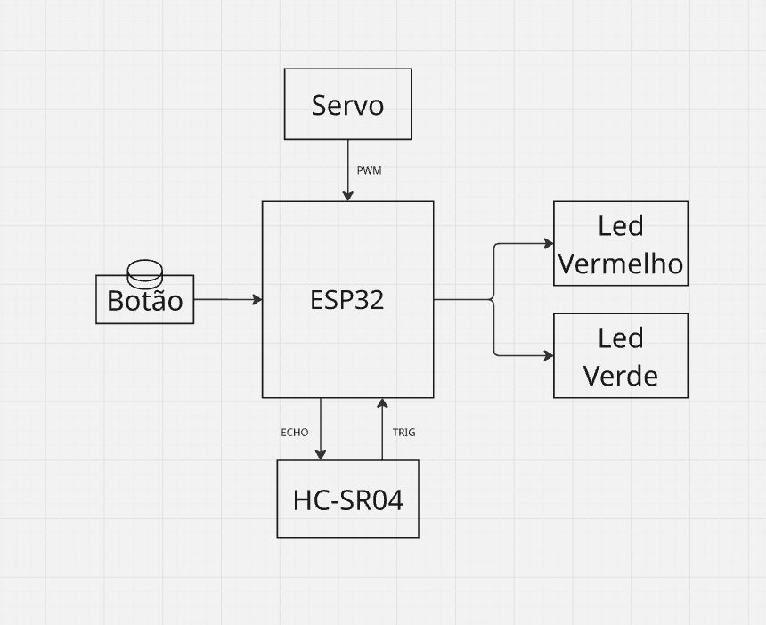

# ECOP11A-Projeto-Final
Introdução a Programação: Projeto Final com Introdução a Engenharia

## Equipe
- Cauã Sales Silva (2025006044)
- Keytwoleany Marjhourie Costa (2025003051)
- Diuari Campos Félix (2025003060)
- Ariel Floriano da Silva (2024001384)
- Maria Eduarda Ribeiro (2024016242)
- Fabrício Silva Celestino (2025007598)

## Objetivo
Sistema de Alarme de invasão residencial via wifi com auxilio de bot no Telegram. O sistema inicia com o usuário iniciando o alarme no telegram, após o alarme ativado caso o sensor ultrassonico
identifique uma pessoa não autorizada ele manda um alerta para o usuário que tem a opção de chamar as autoridades e fechar o cômodo com o servo motor prendendo a pessoa não autorizada, até que as autoridades cheguem.
E também possui um botão manual para desabilitar o alarme e leds para sinalizar o estado do servo motor.

## Componentes 
- Esp32
- Protoboard
- Servo Motor
- Led verde e vermelho
- Sensor Ultrasônico
- Jumpers
- Botão

## Diagrama em Blocos

## Circuito no EasyEDA

## Foto Real

## Fluxograma

